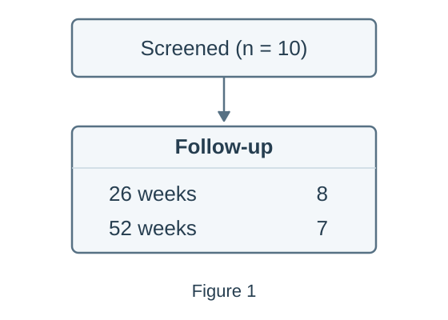
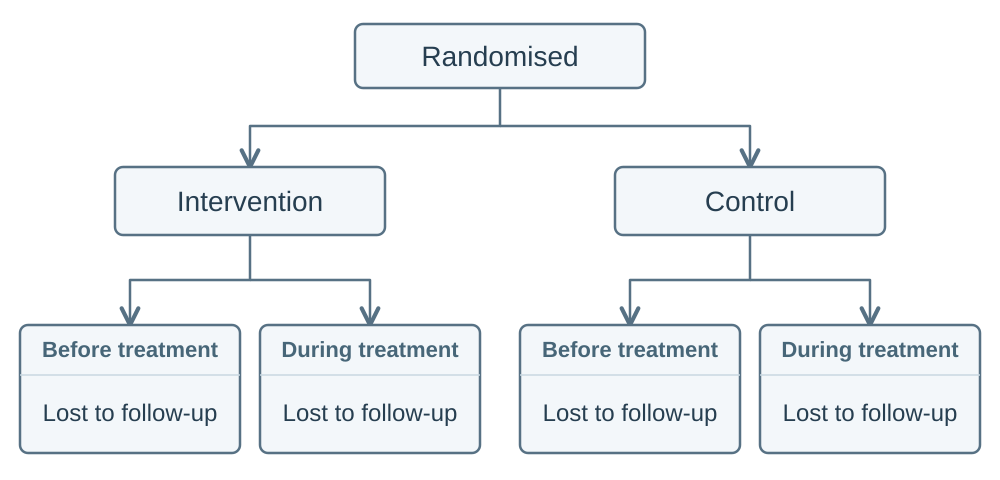

# Parsing benchmark

The
[`ParsingBenchmark`](../reference/benchmarks.md#flowde.benchmarks.parsing.parsing_bench.ParsingBenchmark)
is used to evaluate how well a parsing function has extracted node text, labels,
flow and additional text.

## Input format

Suppose we have the following flowchart, `example_0`:

<!-- prettier-ignore -->
{.docs-image}

For this flowchart, the prediction and ground-truth files could have the
following directory structure:

```text
data/ground-truth/
├── nodes/
│   └── example_0.json
├── labels/
│   └── example_0.json
├── flow/
│   └── example_0.json
└── additional_texts/
    └── example_0.json
results/predictions/
└── example_0.json
```

The filename stem, `example_0`, identifies the same flowchart in every
directory. Ground truth must contain all four parts, even when the predictions
contain only some parts.

### Prediction files

Predictions use the JSON format saved by
[`parse_imgs()`](../reference/pipeline.md#flowde.parse_imgs.parse_imgs). The
prediction contains deliberate text and flow errors to demonstrate the benchmark
scores. `results/predictions/example_0.json` contains:

```json
{
  "nodes": [
    {
      "node_number": 1,
      "text": "Screened (n = 11)",
      "labels": [],
      "points_to": [2, 3]
    },
    {
      "node_number": 2,
      "text": "8",
      "labels": ["Follow-up", "26 week"],
      "points_to": []
    },
    {
      "node_number": 3,
      "text": "7",
      "labels": ["Follow-up", "52 weeks"],
      "points_to": []
    }
  ],
  "additional_texts": ["Figure 2"]
}
```

### Ground-truth files

Ground truth separates node text, labels, flow and additional text into four
files. Each file contains an `options` list, and each ground-truth option
describes one complete accepted interpretation.

The flowchart above can be correctly represented using the two possible options:

| Option index | Node-text file                                                     | Label file                                 | Flow file    | Additional-text file |
| ------------ | ------------------------------------------------------------------ | ------------------------------------------ | ------------ | -------------------- |
| `0`          | Screened node and one follow-up node containing `8\n7`.            | Joined `26 weeks\n52 weeks` label.         | `1 → 2`.     | `Figure 1`.          |
| `1`          | Screened node and separate follow-up nodes containing `8` and `7`. | Separate `26 weeks` and `52 weeks` labels. | `1 → 2 → 3`. | `Figure 1`.          |

Therefore the ground truth files are given by:

**Node text:** `data/ground-truth/nodes/example_0.json`

```json
{
  "options": [
    {
      "nodes": [
        { "node_number": 1, "text": "Screened (n = 10)" },
        { "node_number": 2, "text": "8\n7" }
      ]
    },
    {
      "nodes": [
        { "node_number": 1, "text": "Screened (n = 10)" },
        { "node_number": 2, "text": "8" },
        { "node_number": 3, "text": "7" }
      ]
    }
  ]
}
```

**Labels:** `data/ground-truth/labels/example_0.json`

```json
{
  "options": [
    {
      "nodes": [
        { "node_number": 1, "labels": [] },
        { "node_number": 2, "labels": ["Follow-up", "26 weeks\n52 weeks"] }
      ]
    },
    {
      "nodes": [
        { "node_number": 1, "labels": [] },
        { "node_number": 2, "labels": ["Follow-up", "26 weeks"] },
        { "node_number": 3, "labels": ["Follow-up", "52 weeks"] }
      ]
    }
  ]
}
```

**Flow:** `data/ground-truth/flow/example_0.json`

```json
{
  "options": [
    {
      "nodes": [
        { "node_number": 1, "points_to": [2] },
        { "node_number": 2, "points_to": [] }
      ]
    },
    {
      "nodes": [
        { "node_number": 1, "points_to": [2] },
        { "node_number": 2, "points_to": [3] },
        { "node_number": 3, "points_to": [] }
      ]
    }
  ]
}
```

**Additional text:** `data/ground-truth/additional_texts/example_0.json`

```json
{
  "options": [
    { "additional_texts": ["Figure 1"] },
    { "additional_texts": ["Figure 1"] }
  ]
}
```

The benchmark selects one ground-truth option for each prediction and uses that
option for all text and flow scores. See [how diagrams are matched](#how-diagrams-are-matched)
for details on how the benchmark selects which option to use.

## Create the benchmark

You can use
[`ParsingBenchmark`](../reference/benchmarks.md#flowde.benchmarks.parsing.parsing_bench.ParsingBenchmark)
to evaluate the saved predictions:

```python
from pathlib import Path

from flowde.benchmarks.parsing.parsing_bench import ParsingBenchmark

truth_dir = Path("data/ground-truth")

benchmark = ParsingBenchmark(
    pred_diagrams_dir=Path("results/predictions"),
    true_nodes_dir=truth_dir / "nodes",
    true_labels_dir=truth_dir / "labels",
    true_flow_dir=truth_dir / "flow",
    true_additional_texts_dir=truth_dir / "additional_texts",
    expected_num_diagrams=1,
)
```

The benchmark loads the prediction and ground-truth files and checks that the
files are valid. `expected_num_diagrams` counts flowcharts in the complete
ground-truth dataset. This example contains one flowchart with two accepted
Ground-Truth Options, so `expected_num_diagrams=1`.

By default, the benchmark uses
[`levenshtein_with_text_normalisation()`](../reference/benchmarks.md#flowde.benchmarks.parsing.text_distance_fns.levenshtein_fn.levenshtein_with_text_normalisation)
to count character edits after normalising Unicode, whitespace and selected
punctuation variants. You can choose a different
[text distance function](#text-distance-functions) through `distance_fn`.

See the
[`ParsingBenchmark`](../reference/benchmarks.md#flowde.benchmarks.parsing.parsing_bench.ParsingBenchmark)
API reference for full details of the parameters and validation rules.

### Parsing benchmark results

After creating the benchmark object, you can calculate the scores through its
methods:

<!-- markdownlint-disable MD033 -->

| Method                                                                                                                                                     | Return type                                                                                                                    | Result                                                                                                |
| ---------------------------------------------------------------------------------------------------------------------------------------------------------- | ------------------------------------------------------------------------------------------------------------------------------ | ----------------------------------------------------------------------------------------------------- |
| [`benchmark.node_matches()`](../reference/benchmarks.md#flowde.benchmarks.parsing.parsing_bench.ParsingBenchmark.node_matches)                             | <code>list[[NodeMatches](../reference/benchmarks.md#flowde.benchmarks.parsing.parsing_bench_types.NodeMatches)]</code>         | Matched and unmatched nodes, with node-text costs, for each flowchart.                                |
| [`benchmark.node_matches_with_flow()`](../reference/benchmarks.md#flowde.benchmarks.parsing.parsing_bench.ParsingBenchmark.node_matches_with_flow)         | <code>list[[NodeMatches](../reference/benchmarks.md#flowde.benchmarks.parsing.parsing_bench_types.NodeMatches)]</code>         | Node matches for each flowchart, requiring parsed flow so each result can calculate its `flow_score`. |
| [`benchmark.node_and_label_matches()`](../reference/benchmarks.md#flowde.benchmarks.parsing.parsing_bench.ParsingBenchmark.node_and_label_matches)         | <code>list[[NodeMatches](../reference/benchmarks.md#flowde.benchmarks.parsing.parsing_bench_types.NodeMatches)]</code>         | Node matches and matched and unmatched labels, with label costs, for each flowchart.                  |
| [`benchmark.additional_text_matches()`](../reference/benchmarks.md#flowde.benchmarks.parsing.parsing_bench.ParsingBenchmark.additional_text_matches)       | <code>list[[TextListMatches](../reference/benchmarks.md#flowde.benchmarks.parsing.parsing_bench_types.TextListMatches)]</code> | Matched and unmatched additional-text strings, with costs, for each flowchart.                        |
| [`benchmark.diagram_matches()`](../reference/benchmarks.md#flowde.benchmarks.parsing.parsing_bench.ParsingBenchmark.diagram_matches)                       | <code>list[[DiagramMatch](../reference/benchmarks.md#flowde.benchmarks.parsing.parsing_bench_types.DiagramMatch)]</code>       | Combined node, label, flow and additional-text comparisons for each flowchart.                        |
| [`benchmark.total_node_text_cost()`](../reference/benchmarks.md#flowde.benchmarks.parsing.parsing_bench.ParsingBenchmark.total_node_text_cost)             | `float`                                                                                                                        | Total node-text cost across the evaluated flowcharts.                                                 |
| [`benchmark.total_label_cost()`](../reference/benchmarks.md#flowde.benchmarks.parsing.parsing_bench.ParsingBenchmark.total_label_cost)                     | `float`                                                                                                                        | Total label cost across the evaluated flowcharts.                                                     |
| [`benchmark.total_additional_text_cost()`](../reference/benchmarks.md#flowde.benchmarks.parsing.parsing_bench.ParsingBenchmark.total_additional_text_cost) | `float`                                                                                                                        | Total additional-text cost across the evaluated flowcharts.                                           |
| [`benchmark.all_flow_scores()`](../reference/benchmarks.md#flowde.benchmarks.parsing.parsing_bench.ParsingBenchmark.all_flow_scores)                       | <code>list[[FlowScores](../reference/benchmarks.md#flowde.benchmarks.parsing.parsing_bench_types.FlowScores)]</code>           | Flow scores for each flowchart, in filename-stem order.                                               |
| [`benchmark.all_flow_jaccard_scores()`](../reference/benchmarks.md#flowde.benchmarks.parsing.parsing_bench.ParsingBenchmark.all_flow_jaccard_scores)       | `list[float]`                                                                                                                  | One flow Jaccard score per flowchart, in filename-stem order.                                         |
| [`benchmark.avg_flow_jaccard()`](../reference/benchmarks.md#flowde.benchmarks.parsing.parsing_bench.ParsingBenchmark.avg_flow_jaccard)                     | `float`                                                                                                                        | Mean flow Jaccard score across the evaluated flowcharts.                                              |

<!-- markdownlint-enable MD033 -->

Before calculating scores, Flowde matches predicted nodes to the ground-truth
nodes they represent. A **Node Match** can pair nodes with different node
numbers: predicted node `2` might represent ground-truth node `1`. Flowde then
uses those matches to compare the node text, labels and connections. See
[how diagrams are matched](#how-diagrams-are-matched) for the matching rules.

### Text costs

For example, you can print the text costs:

```python
print(benchmark.total_node_text_cost())        # 1
print(benchmark.total_label_cost())            # 1
print(benchmark.total_additional_text_cost())  # 1
```

With the default distance function, each cost counts the character insertions,
deletions or substitutions needed to make the normalised prediction match the
normalised ground-truth text. For the selected Ground-Truth Option 1, the
example contains three text differences:

| Part            | Ground truth        | Prediction          | Cost                                 |
| --------------- | ------------------- | ------------------- | ------------------------------------ |
| Node text       | `Screened (n = 10)` | `Screened (n = 11)` | `1`: replace the final `1` with `0`. |
| Labels          | `26 weeks`          | `26 week`           | `1`: insert the missing `s`.         |
| Additional text | `Figure 1`          | `Figure 2`          | `1`: replace `2` with `1`.           |

Each total includes matched and unmatched text across all evaluated flowcharts.

### Flow scores

You can inspect the flow scores for the example flowchart:

```python
score = benchmark.all_flow_scores()[0]
print(score.tp, score.fp, score.fn)  # 1 1 1
print(score.precision)              # 0.5
print(score.recall)                 # 0.5
print(score.f1)                     # 0.5
print(score.jaccard)                # 0.3333333333333333
print(score.missing_edges)          # {(2, 3)}
print(score.extra_edges)            # {(1, 3)}
```

The selected ground-truth Option 1 has connections `1 → 2` and `2 → 3`. The
prediction has connections `1 → 2` and `1 → 3`. The benchmark therefore finds
one correct connection, one extra connection and one missing connection.

Each item returned by
[`all_flow_scores()`](../reference/benchmarks.md#flowde.benchmarks.parsing.parsing_bench.ParsingBenchmark.all_flow_scores)
is a
[`FlowScores`](../reference/benchmarks.md#flowde.benchmarks.parsing.parsing_bench_types.FlowScores)
object with:

| Attribute       | Description                                                                                       | Value in this example |
| --------------- | ------------------------------------------------------------------------------------------------- | --------------------- |
| `tp`            | Number of connections present in both the prediction and ground truth.                            | `1`                   |
| `fp`            | Number of predicted connections absent from the ground truth.                                     | `1`                   |
| `fn`            | Number of ground-truth connections absent from the prediction.                                    | `1`                   |
| `precision`     | Proportion of predicted connections that are correct: `TP / (TP + FP)`.                           | `0.5`                 |
| `recall`        | Proportion of ground-truth connections found: `TP / (TP + FN)`.                                   | `0.5`                 |
| `f1`            | Harmonic mean of precision and recall.                                                            | `0.5`                 |
| `jaccard`       | Correct connections divided by all distinct connections in either diagram: `TP / (TP + FP + FN)`. | `1 / 3`               |
| `missing_edges` | Ground-truth connections absent from the prediction.                                              | `{(2, 3)}`            |
| `extra_edges`   | Predicted connections absent from the ground truth.                                               | `{(1, 3)}`            |

Connections are directed: `1 → 2` differs from `2 → 1`. The reported connection
pairs use ground-truth node numbers after matching; connections involving
unmatched predicted nodes use generated identifiers.

For a dataset containing several flowcharts, you can also print the individual
Jaccard scores and their mean:

```python
print(benchmark.all_flow_jaccard_scores())
print(benchmark.avg_flow_jaccard())
```

[`avg_flow_jaccard()`](../reference/benchmarks.md#flowde.benchmarks.parsing.parsing_bench.ParsingBenchmark.avg_flow_jaccard)
gives each flowchart equal weight. For example, scores of `1.0` and `0.5` give a
mean of `0.75`, regardless of how many connections each flowchart contains.

### Individual matches

Flowde matches predicted nodes to ground-truth nodes using node-text costs,
with mixed-integer linear programming (MILP) to resolve ties using available
flow and labels. See [How diagrams are matched](#how-diagrams-are-matched) for the matching
rules.

You can use the benchmark's matching methods, such as
[`node_matches()`](../reference/benchmarks.md#flowde.benchmarks.parsing.parsing_bench.ParsingBenchmark.node_matches),
to inspect which predicted nodes match which ground-truth nodes and compare
the text and cost of each node pair:

```python
for matches in benchmark.node_matches():
    print("Flowchart:", matches.parent_img_code)
    print("Ground-truth option:", matches.true_diagram_option_idx)
    for match in matches.matches:
        print("Predicted node:", match.pred_node)
        print("Ground-truth node:", match.true_node)
        print("Node-text cost:", match.node_text_cost)
```

An unmatched predicted node has `true_node=None`; an unmatched ground-truth
node has `pred_node=None`.

## Text distance functions

By default, the parsing benchmark uses
[`levenshtein_with_text_normalisation()`](../reference/benchmarks.md#flowde.benchmarks.parsing.text_distance_fns.levenshtein_fn.levenshtein_with_text_normalisation)
to calculate the cost of differences between ground-truth and predicted text.

You can use a different text metric by passing a custom cost function as
`distance_fn` to
[`ParsingBenchmark`](../reference/benchmarks.md#flowde.benchmarks.parsing.parsing_bench.ParsingBenchmark).
For example, this function returns `0` for identical text and `1` for different
text:

```python
def exact_match_cost(*, true_text: str | None, pred_text: str | None) -> int:
    return 0 if (true_text or "") == (pred_text or "") else 1


benchmark = ParsingBenchmark(
    pred_diagrams_dir=Path("results/predictions"),
    true_nodes_dir=truth_dir / "nodes",
    true_labels_dir=truth_dir / "labels",
    true_flow_dir=truth_dir / "flow",
    true_additional_texts_dir=truth_dir / "additional_texts",
    expected_num_diagrams=1,
    distance_fn=exact_match_cost,
)
```

See the
[`DistanceFnProtocol`](../reference/benchmarks.md#flowde.benchmarks.parsing.text_distance_fns.distance_fn_protocol.DistanceFnProtocol)
API reference for the full requirements for custom cost functions.

## Benchmark separately parsed parts

When developing prompts,
[parsing parts separately](../pipeline/parsing.md#parse-parts-separately)
can help improve parsing performance. You can benchmark the parts already
parsed to evaluate each prompt without first parsing every part. For example,
this benchmark evaluates separately parsed node text and labels:

```python
benchmark = ParsingBenchmark(
    pred_diagrams_dir=[
        Path("results/parsing/node_text"),
        Path("results/parsing/labels"),
    ],
    true_nodes_dir=truth_dir / "nodes",
    true_labels_dir=truth_dir / "labels",
    true_flow_dir=truth_dir / "flow",
    true_additional_texts_dir=truth_dir / "additional_texts",
    expected_num_diagrams=1,
)

print("Node-text cost:", benchmark.total_node_text_cost())
print("Label cost:", benchmark.total_label_cost())
```

Predictions must include node text so Flowde can match predicted nodes to
ground-truth nodes. The ground-truth files must still contain all four parts,
even when you have parsed only some parts.

Some methods require additional parsed parts. To see which methods are
available for the predictions in your current benchmark, use:

```python
print(benchmark.capabilities.available_methods)
```

## Missing predictions

By default, the prediction files must cover every ground-truth flowchart. You
can add `allow_missing_pred_diagrams=True` when creating the benchmark to
evaluate only flowcharts with predictions.

## How diagrams are matched

[`ParsingBenchmark`](../reference/benchmarks.md#flowde.benchmarks.parsing.parsing_bench.ParsingBenchmark)
matches predicted nodes to ground-truth nodes by their content, rather than
requiring node numbers to agree. For example, these diagrams describe the same
flow despite using different node numbers:

```text
Ground truth:  Node 1: Screened → Node 2: Included
Prediction:    Node 2: Screened → Node 1: Included
```

[`ParsingBenchmark`](../reference/benchmarks.md#flowde.benchmarks.parsing.parsing_bench.ParsingBenchmark)
matches predicted node `2` to ground-truth node `1`, and predicted node `1`
to ground-truth node `2`. The predicted flow therefore matches the
ground-truth flow.

### How nodes are matched within each ground-truth option

For each option in the ground-truth files,
[`ParsingBenchmark`](../reference/benchmarks.md#flowde.benchmarks.parsing.parsing_bench.ParsingBenchmark)
chooses node matches in this order:

1. Minimise the total node-text cost, including costs for unmatched nodes.
2. Among matches with the same node-text cost, maximise flow similarity if
   flow was parsed.
3. Among matches still tied, minimise label cost if labels were parsed.

For example, this flowchart contains four nodes with the text
`Lost to follow-up`, each labelled `Before treatment` or `During treatment`:

<!-- prettier-ignore -->
{width="100%"}

All four nodes have identical text. Flow distinguishes the loss nodes under
`Intervention` from the loss nodes under `Control`. Within each arm, both
loss nodes have the same incoming flow, so the labels distinguish
`Before treatment` from `During treatment`.

### How a ground-truth option is selected

After matching nodes within each option,
[`ParsingBenchmark`](../reference/benchmarks.md#flowde.benchmarks.parsing.parsing_bench.ParsingBenchmark)
selects the ground-truth option with the lowest total node-text cost. If options
have the same cost,
[`ParsingBenchmark`](../reference/benchmarks.md#flowde.benchmarks.parsing.parsing_bench.ParsingBenchmark)
compares the tied options in this order:

1. Highest flow Jaccard score, if flow was parsed.
2. Lowest label cost, if labels were parsed.
3. Lowest additional-text cost, if additional text was parsed.
