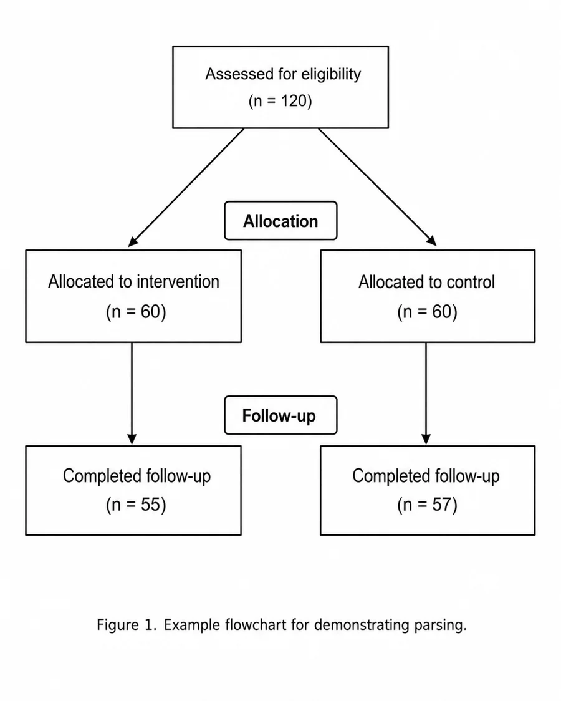
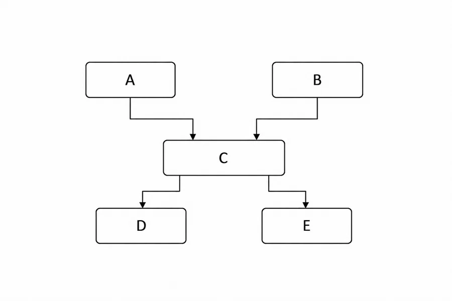
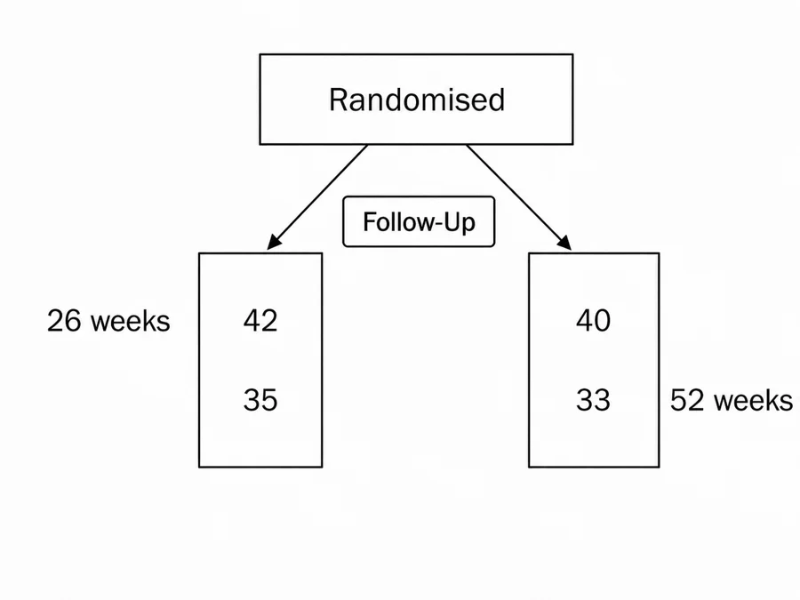

# Flowchart parsing

Parsing is the final stage of the core pipeline. It takes flowchart images as
input and extracts structured flowchart data.

In a typical workflow, we
[extract images](./image-extraction.md#image-extraction),
[classify](./classification.md#image-classification) the relevant flowchart
images, [rotate](./rotation.md#image-rotation) them into the correct
orientation, and then parse them into structured data.

Parsing can be done in one step, or split into smaller parsing tasks. Splitting
the task can improve performance and is useful when you want to or check
intermediate outputs.

## Understand the flowchart format

`flowde` represents parsed flowcharts using nodes and additional texts.

A complete parsed flowchart has this structure:

```python
from pydantic import BaseModel


class Node(BaseModel):
    node_number: int
    text: str
    labels: list[str]
    points_to: list[int]


class Flowchart(BaseModel):
    nodes: list[Node]
    additional_texts: list[str]
```

Each node represents one box or item in the flowchart.

The fields have the following meanings:

- `node_number`: a unique id given to each node in the flowchart;
- `text`: the text inside the node;
- `labels`: text labels that apply to the node;
- `points_to`: the node numbers that follow this node in the flow;
- `additional_texts`: text that is not assigned to a specific node.

### Example 1: A Basic Flowchart

<!-- prettier-ignore-start -->
<!-- markdownlint-disable MD013 -->
{ .docs-image }

<!-- prettier-ignore-end -->

<!-- markdownlint-enable MD013 -->

Is ideally parsed as:

```json
{
  "nodes": [
    {
      "node_number": 1,
      "text": "Assessed for eligibility\n(n = 120)",
      "labels": [],
      "points_to": [2, 3]
    },
    {
      "node_number": 2,
      "text": "Allocated to intervention\n(n = 60)",
      "labels": ["Allocation"],
      "points_to": [4]
    },
    {
      "node_number": 3,
      "text": "Allocated to control\n(n = 60)",
      "labels": ["Allocation"],
      "points_to": [5]
    },
    {
      "node_number": 4,
      "text": "Completed follow-up\n(n = 55)",
      "labels": ["Follow-up"],
      "points_to": []
    },
    {
      "node_number": 5,
      "text": "Completed follow-up\n(n = 57)",
      "labels": ["Follow-up"],
      "points_to": []
    }
  ],
  "additional_texts": ["Figure 1. Example flowchart for demonstrating parsing."]
}
```

### Example 2: Keeping branches separate

The goal of parsing is to interpret the visual content of an image and convert
it into a standardised JSON format. This means we may not always want to parse
the image exactly as it appears.

Commonly, a flowchart will have two branches that follow the same step; see `C`
in the image below. The author may use a single node to describe the step, but
the branches are still very much consdiered separate. If we parsed this exactly
as it appears in our JSON format, we would lose track of which branch is which:

```text
A → C → [D, E]
B → C → [D, E]
```

<!-- prettier-ignore-start -->
<!-- markdownlint-disable MD013 -->
{ .docs-image }

<!-- prettier-ignore-end -->

<!-- markdownlint-enable MD013 -->

To combat this, if a single node is used to describe a step that applies
separately to each branch, we duplicate the node to keep the branches separate.
Now we are able to capture the underlying meaning of the image in our JSON
format:

```json
{
  "nodes": [
    {
      "node_number": 1,
      "text": "A",
      "labels": [],
      "points_to": [3]
    },
    {
      "node_number": 2,
      "text": "B",
      "labels": [],
      "points_to": [4]
    },
    {
      "node_number": 3,
      "text": "C",
      "labels": [],
      "points_to": [5]
    },
    {
      "node_number": 4,
      "text": "C",
      "labels": [],
      "points_to": [6]
    },
    {
      "node_number": 5,
      "text": "D",
      "labels": [],
      "points_to": []
    },
    {
      "node_number": 6,
      "text": "E",
      "labels": [],
      "points_to": []
    }
  ],
  "additional_texts": []
}
```

This preserves the two intended branches as:

```text
A → C → D
B → C → E
```

### Example 3: Advanced labels

Complicated nodes and labels may require additional processing to convert the
visual content to JSON.

<!-- prettier-ignore-start -->
<!-- markdownlint-disable MD013 -->
{.docs-image }
<!-- prettier-ignore-end -->

<!-- markdownlint-enable MD013 -->

If we parse this exactly as it appears, for the bottom left node, we get
something like this:

```json
...
    {
      "node_number": 2,
      "text": "42\n35",
      "labels": [
        "Follow-Up",
        "26 weeks",
        "52 weeks"
      ],
      "points_to": []
    },
...
```

By parsing `26 weeks` and `52 weeks` as separate labels, each labels appears to
apply to the entire node. This is incorrect. In reality, `26 weeks` applies to
`42` and `52 weeks` applies to `35`.

But remember, our goal is to correctly represent the information in the image,
not to parse the image exactly as it appears.

For this scenario, where labels appear to apply to separate parts of the node,
we have a couple of options:

<div class="indent-section" markdown>

#### Option 1: Join labels

We can join labels that apply to separate parts of a node, into a single label,
effectively capturing that each part of the label applies to a different part of
the node.

```json
...
    {
      "node_number": 2,
      "text": "42\n35",
      "labels": [
        "Follow-Up",
        "26 weeks\n52 weeks",
      ],
      "points_to": []
    },
...
```

Now `26 weeks\n52 weeks` correctly applies to `42\n35`

#### Option 2: Split nodes

In cases such as this one, the bottom left node would probably be more
accurately represented by 2 separate nodes. We can split the nodes like these to
more accurately capture the information in the image.

The the bottom left node would become:

```json
...
    {
      "node_number": 2,
      "text": "42",
      "labels": [
        "Follow-Up",
        "26 weeks"
      ],
      "points_to": [4]
    },
    ...
    {
      "node_number": 4,
      "text": "35",
      "labels": [
        "Follow-Up",
        "52 weeks"
      ],
      "points_to": []
    },
...
```

Now we correctly capture that 42 patients attended the 26 weeks follow-up and 35
patients attended the 52 weeks follow-up.

</div>

## Parse full or partial flowcharts

`flowde` can parse a flowchart in one call, or split the task into smaller
parts.

### Parsing options

There are three main ways to parse a flowchart:

- **Full parsing:** parse the whole flowchart in one step.
- **Partial parsing:** parse one part of the flowchart, such as node text or
  flow.
- **Combined partial parsing:** parse several parts together, such as node text
  and labels.

Full parsing is simpler. Partial parsing usually gives better performance, but
it is more expensive because it requires multiple model calls.

### Flowchart parts

The supported parsing parts are:

| Parse type         | Output fields         |
| ------------------ | --------------------- |
| `node_text`        | `node_number`, `text` |
| `labels`           | `labels`              |
| `flow`             | `points_to`           |
| `additional_texts` | `additional_texts`    |

See [Understand the flowchart format](#understand-the-flowchart-format) for more
details on these fields.

### Using partial results as context

Partial parsing lets you use earlier parsed results as context for later parsing
steps.

For example, you might first parse the node text:

```python
parts_to_parse={"node_text"}
```

Then use those parsed nodes as context when parsing labels or flow:

```python
parts_to_parse={"labels"}
```

```python
parts_to_parse={"flow"}
```

When parsing `labels`, `flow`, or `additional_text` using existing partial
results, the corresponding node text files must also be provided. This is
because node numbers are needed to join the different parsed parts together.

## Define a parsing function

Before running parsing, define the function that will parse each image. This can
be one of the default LLM-based parsing functions, or a custom function that you
provide.

A parsing function takes the path to one image and an optional partial
flowchart. It returns a Pydantic model containing the parsed result.

### Use a default parsing function

`flowde` includes default parsing functions using OpenAI and Gemini models.

<!-- markdownlint-disable MD046 -->
<!-- prettier-ignore-start -->

!!! note "Default parsing with Gemini or OpenAI"
    To use either of the default parsing functions, follow the
    [setup default parsing and classification](./setup-default-funcs.md#setup-default-parsing-and-classification)
    steps.

<!-- prettier-ignore-end -->

<!-- markdownlint-enable MD046 -->

To define an OpenAI parsing function:

```python
from flowde.parsing_fns.openai_parse import make_openai_parse_fn

input_text = """
Parse this flowchart into structured data.
"""

parse_fn = make_openai_parse_fn(
    input_text=input_text,
    model="gpt-5.4-mini",
    effort="high",
)
```

By default, this parses all supported parts:

- `node_text`
- `labels`
- `flow`
- `additional_text`

To parse only particular parts, pass `parts_to_parse`:

```python
parse_fn = make_openai_parse_fn(
    input_text=input_text,
    model="gpt-5.4-mini",
    effort="high",
    parts_to_parse={"node_text"},
)
```

To use Gemini instead, use `make_gemini_parse_fn`:

```python
from flowde.parsing_fns.gemini_parse import make_gemini_parse_fn

parse_fn = make_gemini_parse_fn(
    input_text=input_text,
    model="gemini-3.1-flash-lite",
    effort="high",
    parts_to_parse={"node_text"},
)
```

See (insert API ref docs here) for details about params.

### Bring your own parsing function

You do not have to use the default OpenAI or Gemini parsing helpers. Any
function with the same interface can be used.

A custom parsing function must accept an image path and an optional partial
flowchart, and return a Pydantic model:

```python
from pathlib import Path

from pydantic import BaseModel


def my_parse_fn(
    img_path: Path,
    partial_flowchart: BaseModel | None = None,
) -> BaseModel:
    ...
```

The `partial_flowchart` argument is optional. If no partial flowchart data is
provided, `flowde` calls the parsing function with only the image.

## Run parsing

After defining `parse_fn`, pass it to one of the parsing pipeline functions.

Most users should use `parse_imgs`. This takes a directory of PNG images, parses
each image, and saves the parsed JSON outputs to a directory.

### Parse images from a directory

```python
from pathlib import Path

from flowde.parse_imgs import parse_imgs

responses = parse_imgs(
    parse_fn=parse_fn,
    img_dir=Path("data/rotated-flowchart-images"),
    save_dir=Path("data/parsed-flowcharts"),
    n_jobs=1,
)
```

The input directory should contain the PNG images at the top level. `parse_imgs`
searches for files matching `*.png` directly inside `img_dir`.

For example:

```text
data/
└── rotated-flowchart-images/
    ├── paper-1_0.png
    ├── paper-2_0.png
    └── paper-3_0.png
```

Parsed outputs are saved as JSON files in `save_dir`. The output filenames use
the image stem:

```text
data/
└── parsed-flowcharts/
    ├── paper-1_0.json
    ├── paper-2_0.json
    └── paper-3_0.json
```

The returned `responses` list contains the parsed Pydantic model for each image,
in sorted path order.

### Parse only part of a flowchart

Use `parts_to_parse` when creating the parsing function.

For example, to parse only node text:

```python
from flowde.parsing_fns.openai_parse import make_openai_parse_fn
from flowde.parse_imgs import parse_imgs

parse_fn = make_openai_parse_fn(
    input_text=input_text,
    model="gpt-5.4-mini",
    effort="high",
    parts_to_parse={"node_text"},
)

responses = parse_imgs(
    parse_fn=parse_fn,
    img_dir=Path("data/rotated-flowchart-images"),
    save_dir=Path("data/parsed-node-text"),
)
```

This produces JSON files containing only the requested fields.

For `parts_to_parse={"node_text"}`, the output will contain nodes with node
numbers and text:

```json
{
  "nodes": [
    {
      "node_number": 1,
      "text": "Assessed for eligibility (n = 120)"
    },
    {
      "node_number": 2,
      "text": "Randomised (n = 100)"
    }
  ]
}
```

### Parse using existing partial flowcharts

You can provide previously parsed parts as context for another parsing step.

For example, after parsing node text, you can use those node files when parsing
labels:

```python
from pathlib import Path

from flowde.parsing_fns.openai_parse import make_openai_parse_fn
from flowde.parse_imgs import parse_imgs

parse_fn = make_openai_parse_fn(
    input_text=input_text,
    model="gpt-5.4-mini",
    effort="high",
    parts_to_parse={"labels"},
)

responses = parse_imgs(
    parse_fn=parse_fn,
    img_dir=Path("data/rotated-flowchart-images"),
    save_dir=Path("data/parsed-labels"),
    nodes_dir=Path("data/parsed-node-text"),
)
```

The files in `img_dir`, `save_dir`, and `nodes_dir` must have matching stems.

For example:

```text
data/
├── rotated-flowchart-images/
│   ├── paper-1_0.png
│   └── paper-2_0.png
└── parsed-node-text/
    ├── paper-1_0.json
    └── paper-2_0.json
```

This lets `flowde` match each image to the corresponding partial flowchart.

### Parse labels, flow, or additional text

You can provide different partial directories depending on what you want to
parse.

To parse flow using existing nodes:

```python
parse_fn = make_openai_parse_fn(
    input_text=input_text,
    model="gpt-5.4-mini",
    effort="high",
    parts_to_parse={"flow"},
)

responses = parse_imgs(
    parse_fn=parse_fn,
    img_dir=Path("data/rotated-flowchart-images"),
    save_dir=Path("data/parsed-flow"),
    nodes_dir=Path("data/parsed-node-text"),
)
```

To parse additional text using existing nodes:

```python
parse_fn = make_openai_parse_fn(
    input_text=input_text,
    model="gpt-5.4-mini",
    effort="high",
    parts_to_parse={"additional_text"},
)

responses = parse_imgs(
    parse_fn=parse_fn,
    img_dir=Path("data/rotated-flowchart-images"),
    save_dir=Path("data/parsed-additional-text"),
    nodes_dir=Path("data/parsed-node-text"),
)
```

You can also provide multiple existing parts:

```python
responses = parse_imgs(
    parse_fn=parse_fn,
    img_dir=Path("data/rotated-flowchart-images"),
    save_dir=Path("data/parsed-flow"),
    nodes_dir=Path("data/parsed-node-text"),
    labels_dir=Path("data/parsed-labels"),
    additional_texts_dir=Path("data/parsed-additional-text"),
)
```

If any of `labels_dir`, `additional_texts_dir`, or `flow_dir` are provided,
`nodes_dir` must also be provided. This is because node numbers are needed to
join the different partial flowchart parts together.

### Parse a subset of images

Use `range_indices` to parse only a slice of the images in a directory.

```python
responses = parse_imgs(
    parse_fn=parse_fn,
    img_dir=Path("data/rotated-flowchart-images"),
    save_dir=Path("data/parsed-flowcharts"),
    range_indices=(0, 10),
)
```

This parses the images from index `0` up to, but not including, index `10` after
the image paths have been sorted.

This can be useful for testing a parsing function on a small number of images
before running it on the full directory.

### Parse an explicit list of images

If you do not want to parse every PNG in a directory, use
`parse_imgs_from_paths`. This lets you pass the image paths and save paths
directly.

```python
from pathlib import Path

from flowde.parse_imgs import parse_imgs_from_paths

img_paths = [
    Path("data/rotated-flowchart-images/paper-1_0.png"),
    Path("data/rotated-flowchart-images/paper-2_0.png"),
]

save_paths = [
    Path("data/parsed-flowcharts/paper-1_0.json"),
    Path("data/parsed-flowcharts/paper-2_0.json"),
]

responses = parse_imgs_from_paths(
    parse_fn=parse_fn,
    img_paths=img_paths,
    save_paths=save_paths,
    n_jobs=1,
)
```

You can also provide explicit partial paths:

```python
responses = parse_imgs_from_paths(
    parse_fn=parse_fn,
    img_paths=img_paths,
    save_paths=save_paths,
    nodes_paths=[
        Path("data/parsed-node-text/paper-1_0.json"),
        Path("data/parsed-node-text/paper-2_0.json"),
    ],
    labels_paths=[
        Path("data/parsed-labels/paper-1_0.json"),
        Path("data/parsed-labels/paper-2_0.json"),
    ],
)
```

All provided path lists must have the same length and matching stems.

### Parallelism

Both `parse_imgs` and `parse_imgs_from_paths` accept an `n_jobs` parameter to
control the number of parallel processes of `parse_fn` to run.

By default, they will try to use all CPU cores available. If your `parse_fn` is
memory heavy, or if it calls an external API, you may need to manually reduce
the number of jobs.

```python
from pathlib import Path

from flowde.parse_imgs import parse_imgs

responses = parse_imgs(
    parse_fn=parse_fn,
    img_dir=Path("data/rotated-flowchart-images"),
    save_dir=Path("data/parsed-flowcharts"),
    n_jobs=1,
)
```

## Output validation

The default OpenAI and Gemini parsing helpers build a Pydantic response schema
from `parts_to_parse`.

For example:

```python
parts_to_parse={"node_text"}
```

requires a response containing only node text fields, while:

```python
parts_to_parse={"node_text", "labels", "flow", "additional_text"}
```

requires a complete flowchart response.

Extra fields are not allowed in the parsed output. This helps ensure that each
parsing step returns only the fields requested for that step.

## Next step

After parsing, use the benchmarking tools to compare parsed flowcharts against
ground-truth flowchart data.
