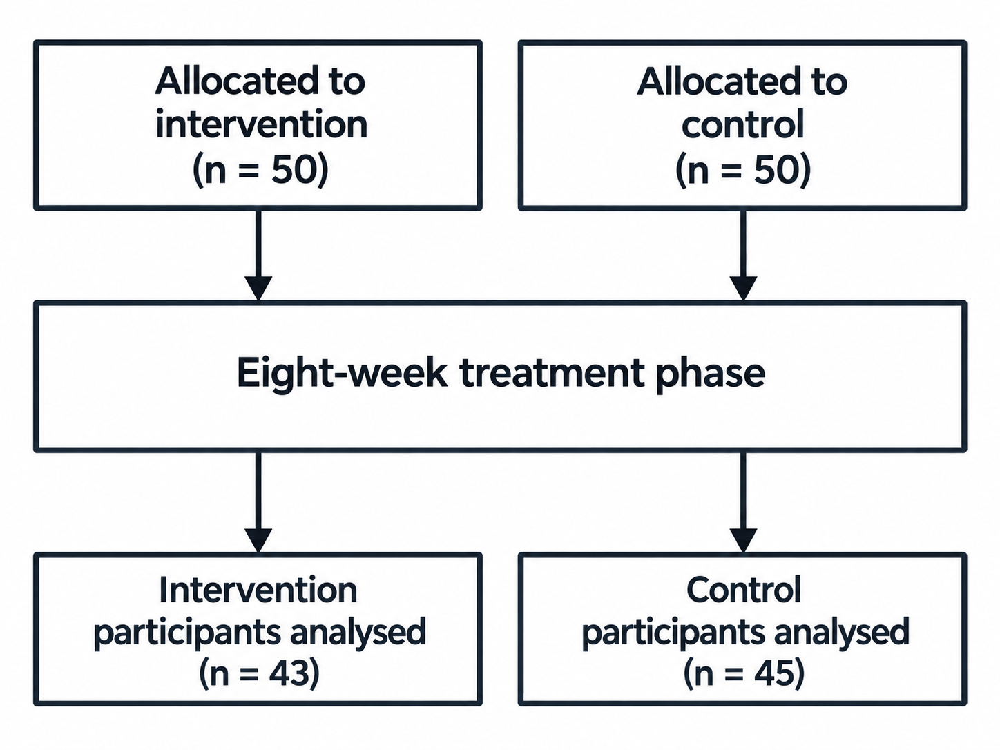

# Flowchart parsing

Parsing is the final stage of the core pipeline. It takes flowchart images as
input and extracts structured flowchart data.

The parsed data describes the nodes, their text and labels, the connections
between nodes, and any additional text in the diagram.

## Parse images from a directory

[`parse_imgs()`](../reference/pipeline.md#flowde.parse_imgs.parse_imgs)
takes a directory of flowchart images and saves one JSON result per image
into a dedicated output directory.

```python
from pathlib import Path

from flowde.parse_imgs import parse_imgs
from flowde.parsing_fns.openai_parse import make_openai_parse_fn

img_dir = Path("results/rotation/rotated_images")
save_dir = Path("results/parsing/full")

input_text = """
Parse this flowchart into structured data.
Assign consecutive node numbers starting at 1.
Capture each node's text, labels and outgoing connections.
Put text that does not belong to a node in additional_texts.
"""

parse_fn = make_openai_parse_fn(
    input_text=input_text,
    model="gpt-5.6-luna",
    effort="medium",
)

responses = parse_imgs(
    parse_fn=parse_fn,
    img_dir=img_dir,
    save_dir=save_dir,
    max_concurrent_jobs=1,
)
```

By default,
[`parse_imgs()`](../reference/pipeline.md#flowde.parse_imgs.parse_imgs)
processes `*.png` files inside `img_dir`, in sorted path order.
Subdirectories are not searched. The returned `responses` list contains one
Pydantic model per processed image: `responses[0]` contains the parsed data for
the first sorted image path, `responses[1]` for the second, and so on.

The example above uses OpenAI and requires the
[OpenAI setup](setup-default-funcs.md#set-up-openai).
For `parse_fn`, you can use an OpenAI parser created with
[`make_openai_parse_fn()`](../reference/helpers.md#flowde.parsing_fns.openai_parse.make_openai_parse_fn),
a Gemini parser created with
[`make_gemini_parse_fn()`](../reference/helpers.md#flowde.parsing_fns.gemini_parse.make_gemini_parse_fn),
or [your own parsing function](custom-functions.md#a-parsing-function).
The [provider setup guide](setup-default-funcs.md#use-azure-openai) also covers
Azure OpenAI.

[`make_openai_parse_fn()`](../reference/helpers.md#flowde.parsing_fns.openai_parse.make_openai_parse_fn)
creates a parser for the complete flowchart format by default. You can instead
[parse selected parts](#parse-parts-separately), such as node text or connections,
or [use a custom output schema](#use-a-custom-output-schema).

See the
[`parse_imgs()`](../reference/pipeline.md#flowde.parse_imgs.parse_imgs)
and
[`make_openai_parse_fn()`](../reference/helpers.md#flowde.parsing_fns.openai_parse.make_openai_parse_fn)
API references for full details of all parameters.

## Parsing results

Each image's result is saved as a JSON file with the same filename stem.
For example, `paper-1_0.png` produces `paper-1_0.json`:

```text
results/parsing/full/
├── paper-1_0.json
├── paper-2_0.json
└── .flowde/
    ├── run.state
    └── run.lock
```

You can also inspect a result from the returned `responses` list:

```python
print(responses[0].model_dump_json(indent=2))
```

`.flowde/run.state` records which images have been parsed, their results, parser
settings, image fingerprints and any supplied partial flowchart data. Flowde
uses this metadata to resume the run and detect changes to the inputs or saved
results.

## Understand the flowchart format

Flowde represents a flowchart as a list of nodes and a list of additional texts.

A complete parsed flowchart has this structure:

```python
from pydantic import BaseModel


class Node(BaseModel):
    node_number: int
    text: str
    labels: list[str]
    points_to: list[int]


class Flowchart(BaseModel):
    nodes: list[Node]
    additional_texts: list[str]
```

Each node represents one box or item in the flowchart.

The fields have the following meanings:

- `node_number`: a unique identifier given to each node;
- `text`: the text inside the node;
- `labels`: text labels that apply to the node;
- `points_to`: the node numbers reached by following this node's outgoing arrows;
- `additional_texts`: text that is not assigned to a specific node, such as a caption.

The examples below show how this format represents the information in a
diagram. These interpretation conventions are also used in the supplied
[CONSORT prompts](../reference/helpers.md#supplied-consort-prompts).

### Example 1: A basic flowchart

<!-- prettier-ignore-start -->
<!-- markdownlint-disable MD013 -->
{.docs-image}

<!-- prettier-ignore-end -->

<!-- markdownlint-enable MD013 -->

A complete parse of this diagram looks like:

```json
{
  "nodes": [
    {
      "node_number": 1,
      "text": "Assessed for eligibility\n(n = 120)",
      "labels": [],
      "points_to": [2, 3]
    },
    {
      "node_number": 2,
      "text": "Allocated to intervention\n(n = 60)",
      "labels": ["Allocation"],
      "points_to": [4]
    },
    {
      "node_number": 3,
      "text": "Allocated to control\n(n = 60)",
      "labels": ["Allocation"],
      "points_to": [5]
    },
    {
      "node_number": 4,
      "text": "Completed follow-up\n(n = 55)",
      "labels": ["Follow-up"],
      "points_to": []
    },
    {
      "node_number": 5,
      "text": "Completed follow-up\n(n = 57)",
      "labels": ["Follow-up"],
      "points_to": []
    }
  ],
  "additional_texts": ["Figure 1. Example flowchart for demonstrating parsing."]
}
```

### Example 2: Keeping branches separate

Some diagrams use one box to describe a step that applies separately to two or
more branches. Here, the eight-week treatment phase applies independently to
the intervention group and the control group:

<!-- prettier-ignore-start -->
<!-- markdownlint-disable MD013 -->
{.docs-image}

<!-- prettier-ignore-end -->

<!-- markdownlint-enable MD013 -->

The aligned arrows show two separate participant flows. Of the 50 participants
allocated to intervention, 43 are analysed after the treatment phase. Of the
50 participants allocated to control, 45 are analysed. The shared treatment
box avoids repeating the same text; the two groups do not merge during treatment.

If the parsed data used just one treatment node, both allocation nodes would
point to that treatment node, and the treatment node would point to both
analysis nodes. Those connections would incorrectly allow a path from
intervention allocation to control analysis, and from control allocation to
intervention analysis.

To preserve the intended participant flows, the parsed data represents the
treatment box as two nodes with the same text. Node `3` belongs to the
intervention branch, and node `4` belongs to the control branch:

```json
{
  "nodes": [
    {
      "node_number": 1,
      "text": "Allocated to\nintervention\n(n = 50)",
      "labels": [],
      "points_to": [3]
    },
    {
      "node_number": 2,
      "text": "Allocated to\ncontrol\n(n = 50)",
      "labels": [],
      "points_to": [4]
    },
    {
      "node_number": 3,
      "text": "Eight-week treatment phase",
      "labels": [],
      "points_to": [5]
    },
    {
      "node_number": 4,
      "text": "Eight-week treatment phase",
      "labels": [],
      "points_to": [6]
    },
    {
      "node_number": 5,
      "text": "Intervention\nparticipants analysed\n(n = 43)",
      "labels": [],
      "points_to": []
    },
    {
      "node_number": 6,
      "text": "Control\nparticipants analysed\n(n = 45)",
      "labels": [],
      "points_to": []
    }
  ],
  "additional_texts": []
}
```

The intervention branch follows nodes `1 → 3 → 5`, and the control branch
follows nodes `2 → 4 → 6`. Neither branch has a connection to the other
group's analysis node.

### Example 3: Advanced labels

A single box can contain several values, each with a label that applies only
to that value. The parsed representation needs to preserve which label belongs
to each value.

<!-- prettier-ignore-start -->
<!-- markdownlint-disable MD013 -->
{.docs-image}
<!-- prettier-ignore-end -->

<!-- markdownlint-enable MD013 -->

Representing the bottom-left box as one node could produce:

```text
...
    {
      "node_number": 2,
      "text": "42\n35",
      "labels": [
        "Follow-Up",
        "26 weeks",
        "52 weeks"
      ],
      "points_to": []
    },
...
```

This representation lists `26 weeks` and `52 weeks` as labels for a single node
containing both `42` and `35`, without specifying which label belongs to which
value. The diagram's intended meaning is that `26 weeks` applies to `42` and
`52 weeks` applies to `35`. The parsed data needs to preserve those pairings.
Flowde's format supports two ways to represent those pairings:

<div class="indent-section" markdown>

#### Option 1: Join labels

You can join the timepoint labels into one label, keeping the timepoints in
the same line order as the corresponding values:

```text
...
    {
      "node_number": 2,
      "text": "42\n35",
      "labels": [
        "Follow-Up",
        "26 weeks\n52 weeks",
      ],
      "points_to": []
    },
...
```

The first line, `26 weeks`, corresponds to `42`; the second line, `52 weeks`,
corresponds to `35`.

#### Option 2: Split nodes

You can instead represent the two follow-up measurements as separate nodes,
each with its own value and timepoint label. The bottom-left box becomes:

```text
...
    {
      "node_number": 2,
      "text": "42",
      "labels": [
        "Follow-Up",
        "26 weeks"
      ],
      "points_to": [4]
    },
    ...
    {
      "node_number": 4,
      "text": "35",
      "labels": [
        "Follow-Up",
        "52 weeks"
      ],
      "points_to": []
    },
...
```

The connection from node `2` to node `4` represents
the progression between those follow-up measurements.

</div>

## Resume parsing

To continue an unfinished parsing run whose results are saved in `save_dir`,
you can set `on_existing="resume"`:

```python
responses = parse_imgs(
    parse_fn=parse_fn,
    img_dir=img_dir,
    save_dir=save_dir,
    max_concurrent_jobs=1,
    on_existing="resume",
)
```

The `.flowde/run.state` file inside `save_dir` stores the parsing run's state.
Flowde uses this record to resume unfinished work and check the integrity of the run.
Resume raises an error if the parser's settings have changed, or if previously
parsed input images, their supplied partial flowchart data or saved results
have changed.

To use different settings or partial flowchart data, you can start a run in a
new `save_dir` or replace the previous run with `on_existing="overwrite"`.
See [managing runs](resuming.md) for the full rules.

## Parse parts separately

Splitting parsing into separate tasks can improve parsing accuracy by allowing
the model to focus on one part of the flowchart at a time and use earlier
results as context for later requests. You can also inspect intermediate
results.

<!-- prettier-ignore-start -->
<!-- markdownlint-disable MD046 -->

!!! important

    `node_text` must be parsed **before or together with** `labels` or `flow`
    so the parser knows which node numbers to use for labels and connections.
    If node text was parsed in an earlier run, pass the saved node-text
    directory as `nodes_dir`.

<!-- markdownlint-enable MD046 -->
<!-- prettier-ignore-end -->

### 1. Parse node text

```python
from pathlib import Path

from flowde.parse_imgs import parse_imgs
from flowde.parsing_fns.openai_parse import make_openai_parse_fn

img_dir = Path("results/rotation/rotated_images")
parts_dir = Path("results/parsing")

nodes_fn = make_openai_parse_fn(
    input_text=(
        "Parse the text of every node. Use consecutive node numbers starting "
        "at 1 and keep separate flowchart branches separate."
    ),
    model="gpt-5.6-luna",
    effort="medium",
    parts_to_parse={"node_text"},
)

nodes = parse_imgs(
    parse_fn=nodes_fn,
    img_dir=img_dir,
    save_dir=parts_dir / "node_text",
    max_concurrent_jobs=1,
)
```

The `parts_to_parse={"node_text"}` argument tells
[`make_openai_parse_fn()`](../reference/helpers.md#flowde.parsing_fns.openai_parse.make_openai_parse_fn)
to create a parser that returns only node numbers and text. For example, a
two-node diagram could produce:

```json
{
  "nodes": [
    { "node_number": 1, "text": "Assessed for eligibility (n = 120)" },
    { "node_number": 2, "text": "Randomised (n = 100)" }
  ]
}
```

`node_text` is the parsing-part name. `nodes` is the JSON field holding the
node objects. This example saves the node-text JSON files in
`results/parsing/node_text`.

You can choose from four parsing parts:

| `parts_to_parse` value | Fields in the result                              |
| ---------------------- | ------------------------------------------------- |
| `"node_text"`          | `nodes`, containing `node_number` and `text`      |
| `"labels"`             | `nodes`, containing `node_number` and `labels`    |
| `"flow"`               | `nodes`, containing `node_number` and `points_to` |
| `"additional_texts"`   | The top-level `additional_texts` list             |

You can request several parts together, such as `{"node_text", "labels"}`.
Without `parts_to_parse` or a custom `result_structure`, the OpenAI and Gemini
parser factories request all four parts.

### 2. Parse flow using the saved nodes

```python
flow_fn = make_openai_parse_fn(
    input_text=(
        "Find the outgoing connections for every supplied node. "
        "Use the supplied node numbers without changing them."
    ),
    model="gpt-5.6-luna",
    effort="medium",
    parts_to_parse={"flow"},
)

flow = parse_imgs(
    parse_fn=flow_fn,
    img_dir=img_dir,
    save_dir=parts_dir / "flow",
    nodes_dir=parts_dir / "node_text",
    max_concurrent_jobs=1,
)
```

For each input image, `nodes_dir` supplies the node numbers and text from the
matching JSON file in `results/parsing/node_text`. The parser receives that
saved data alongside the image so the prompt can ask for outgoing connections
using the existing node numbers.

`parts_to_parse={"flow"}` tells the parser to parse only the outgoing connections
for each node. For example:

```json
{
  "nodes": [
    { "node_number": 1, "points_to": [2] },
    { "node_number": 2, "points_to": [] }
  ]
}
```

The flow JSON files are saved in `results/parsing/flow`.

### 3. Parse labels and additional text

Likewise, you can parse labels with `parts_to_parse={"labels"}` and additional
text with `parts_to_parse={"additional_texts"}`. You can pass previously parsed
parts as context through the following
[`parse_imgs()`](../reference/pipeline.md#flowde.parse_imgs.parse_imgs)
parameters:

| Parameter              | Directory containing              |
| ---------------------- | --------------------------------- |
| `nodes_dir`            | Previously parsed nodes           |
| `labels_dir`           | Previously parsed labels          |
| `flow_dir`             | Previously parsed flow            |
| `additional_texts_dir` | Previously parsed additional text |

### Matching images and parsed parts

Each parsed part is saved as a JSON file with the same filename stem as the
source image. For example, the parts parsed from `paper-1_0.png` are saved as
`paper-1_0.json` in each part's directory:

```text
results/
├── rotation/
│   └── rotated_images/
│       ├── paper-1_0.png
│       └── paper-2_0.png
└── parsing/
    ├── node_text/
    │   ├── paper-1_0.json
    │   ├── paper-2_0.json
    │   └── .flowde/
    ├── flow/
    │   ├── paper-1_0.json
    │   ├── paper-2_0.json
    │   └── .flowde/
    ├── labels/
    │   ├── paper-1_0.json
    │   ├── paper-2_0.json
    │   └── .flowde/
    └── additional_texts/
        ├── paper-1_0.json
        ├── paper-2_0.json
        └── .flowde/
```

### Combine the parsed parts

You can combine the saved node text, labels, connections and additional text
into one JSON file per image:

```python
from flowde.combine_parsed_parts import combine_parsed_parts

combined = combine_parsed_parts(
    nodes_dir=parts_dir / "node_text",
    flow_dir=parts_dir / "flow",
    labels_dir=parts_dir / "labels",
    additional_texts_dir=parts_dir / "additional_texts",
    save_dir=parts_dir / "combined",
)
```

To replace an earlier set of combined results, you can add
`on_existing="overwrite"`. See the
[`combine_parsed_parts()`](../reference/helpers.md#flowde.combine_parsed_parts.combine_parsed_parts)
API reference for full details of the parameters and validation rules.

## Use a custom output schema

You can request a different JSON format by defining a Pydantic schema.
This example asks for a title and a count of the diagram's boxes:

```python
from pydantic import BaseModel, ConfigDict


class DiagramSummary(BaseModel):
    model_config = ConfigDict(extra="forbid")
    title: str
    number_of_boxes: int


summary_fn = make_openai_parse_fn(
    input_text="Give the diagram a short title and count its boxes.",
    model="gpt-5.6-luna",
    effort="medium",
    result_structure=DiagramSummary,
)
```

`result_structure=DiagramSummary` tells
[`make_openai_parse_fn()`](../reference/helpers.md#flowde.parsing_fns.openai_parse.make_openai_parse_fn)
to create a parser with `title` and `number_of_boxes` in its results. A custom
schema replaces the standard flowchart format, so `result_structure` and
`parts_to_parse` cannot be supplied together. See the
[factory API reference](../reference/helpers.md#flowde.parsing_fns.openai_parse.make_openai_parse_fn)
for the parameters.

Flowde's parsing benchmark expects the standard flowchart format, so arbitrary
custom results such as `DiagramSummary` need their own evaluation method.

## Bring your own parsing function

You can write your own parser and pass it to
[`parse_imgs()`](../reference/pipeline.md#flowde.parse_imgs.parse_imgs)
as `parse_fn`. See the
[custom parsing tutorial](custom-functions.md#a-parsing-function)
for the requirements your function must meet and a complete working example.

## Next step

You can [benchmark the parsed results](../benchmarking/parsing.md) against
manually annotated ground truth.
